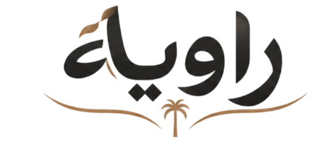
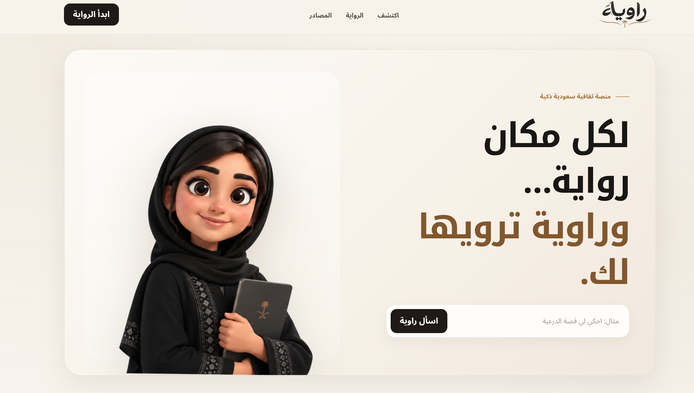

# راوية | Rawiyah

  

راوية منصة ثقافية ذكية تهدف إلى تقديم التراث والهوية السعودية بأسلوب قصصي تفاعلي ومبسّط، مع الاعتماد على معلومات موثوقة ومصادر واضحة.

## الواجهة الرئيسية

  

## عن راوية

تسمح راوية للمستخدم بطرح سؤال عن موقع تاريخي، شخصية، حدث، أو عنصر تراثي، ثم تقوم بتحليل السؤال واسترجاع المعلومات ذات الصلة من قاعدة بيانات موثوقة، وصياغة إجابة قصيرة وواضحة يمكن الاستماع إليها صوتيًا أو الانتقال منها إلى رواية تفاعلية أكثر تفصيلًا.

## شخصية راوية

  

## التقنيات المستخدمة

يعتمد المشروع على مجموعة من الأدوات والنماذج المحلية، من بينها:

- Python
- Flask
- HTML / CSS / JavaScript
- ALLaM
- AraBERT
- Transformers
- PyTorch
- llama.cpp
- Text-to-Speech
- JSON كقاعدة بيانات للمحتوى الموثوق

## طريقة عمل راوية

تسير عملية الإجابة بشكل مبسط كالتالي:

1. يكتب المستخدم سؤاله.
2. يتم تحليل نوع السؤال باستخدام AraBERT.
3. يتم البحث داخل بيانات التراث الموثوقة.
4. يتم اختيار السجل الأقرب إلى سؤال المستخدم.
5. تُرسل الحقائق المسترجعة إلى ALLaM لصياغة الإجابة.
6. يتم التحقق من أن الإجابة لا تحتوي على معلومات غير مدعومة.
7. يمكن للمستخدم الاستماع إلى الإجابة أو الانتقال إلى الرواية التفاعلية.

